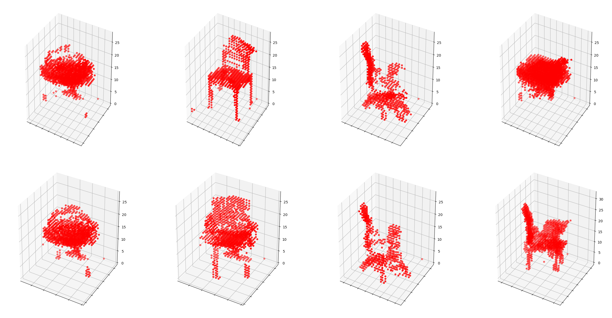
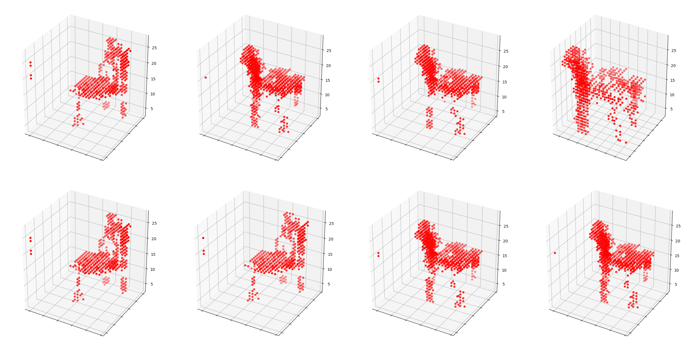

# Simple 3D-GAN-PyTorch

<!-- 

 -->

## Introuction

* This is a very simple-to-use pytorch implementation of part of the [paper](https://arxiv.org/abs/1610.07584) "Learning a Probabilistic Latent Space of Object Shapes via 3D Generative-Adversarial Modeling". I provide the complete pipeline of loading dataset, training, evaluation and visualization here and also I would share some results based on different parameter settings.

## Updates
* 17 March, 2021: added gitignore, removed some unrelated files, updated prerequisites to python 3.7.9 + pytorch 1.6.0, fixed mplot3d

### Prerequisites

* Python 3.7.9 | Anaconda4.x
* Pytorch 1.6.0
* tensorboardX 2.1
* matplotlib 2.1
* visdom (optional)

### Pipeline

Basically I already put the `chair` dataset and a trained model as an example in `volumetric_data` and `outputs` folders. You can directly go to the training or evaluation part. But I still give a complete pipeline here.

#### Data
* First, click [here](http://3dshapenets.cs.princeton.edu/3DShapeNetsCode.zip) to download the dataset. Then unzip it and put the `volumetric_data` folder to the path of our main repository. As we use ModelNet instead of ShapeNet here, the results may be inconsistent with the paper.

#### Training
* Then `cd src`, simply run `python main.py` on GPU or CPU. Of course, you need a GPU for training until getting good results. I used one GeForce GTX 1070 in my experiments on 3D models with resolution of 32x32x32. The maximum number of channels of feature map is 256. Because of these, the results may be inconsistent with the paper. You may need a stronger one for higher resolution one 64x64x64 and 512 feature maps. 

* Other arguments could be used, for example, `python main.py --logs=<SOMETHING_YOU_WANT_TO_LOG>` would start the tensorboardX for logging to `outputs` folder. For local debugging, you can run `python main.py --local_test=True`.

* During training, model weights and some 3D reconstruction images would be also logged to the `outputs`, `images` folders, respectively, for every `model_save_step` number of step in `params.py`. You can play with all parameters in `params.py`.

#### Evaluation
* For evaluation for trained model, you can run `python main.py --test=True` to call `tester.py`.
* If you want to visualize using visdom, first run `python -m visdom.server`, then `python main.py --test=True --use_visdom=True`.
* For more results, see the following or the `results` folder.

<!-- 
### GAN Trick
I use some more trick for better result
* the loss function to optimize G is `min (log 1-D)`, but in practice folks practically use `max log D`
* Z is Sampled from a gaussian distribution [0, 0.33]
* Use Soft Labels - It make loss function smoothing (When I don't use soft labels , I observe divergence after 500 epochs)
* learning rate scheduler - after 500 epoch, descriminator's learning rate is decayed

If you want to know more trick , 
go to  [Soumith’s ganhacks repo.](https://github.com/soumith/ganhacks)
 -->

### Basic Parameter Settings
* Here I list some basic parameter settings and in the results section I would change some specific parameters and see what happens.
* Batch size is 32, which depends on the memory and I do not see much difference by changing it.
* Learning rate, beta values for Adam and LeakyReLU parameters are the same with the original paper, as well as discriminator update trick based on accuracy.
* Latent z vector is sampled from normal(0, 0.33) following [ganhacks](https://github.com/soumith/ganhacks), but I do not use soft labels in the basic setting.
* Sigmoid function is used at both generator and discriminator for final outputs.

### Results

* I trained all models in the following for 500 epochs and save the last model weights. Some random samples are shown at the last epoch.

* Model 0: basic parameter setting
</img>

* Model 1: change normal(0, 0.33) to uniform(0, 1) for sampling latent z vector based on Model 0
</img>

* Model 2: change sigmoid at generator to tanh based on Model 0
</img>

* Others: I tried soft labels / leakyReLU on both discriminator and generator based on Model 0, they both diverge (or collapse maybe) after somwhere before 500 epochs. For models without the discriminator, we will have a generator with trivial results. Also, I didn't really observe the convergence for all models, after 500 epochs, the loss of discriminator (real + fake) begins to be lower than 1.

### Acknowledgements

* This code is a heavily modified version based on both [3DGAN-Pytorch](https://github.com/rimchang/3DGAN-Pytorch) and [tf-3dgan](https://github.com/meetshah1995/tf-3dgan) and thanks for them. Here I try to build a simpler but more complete pipeline, and explore more results with different settings as well.

